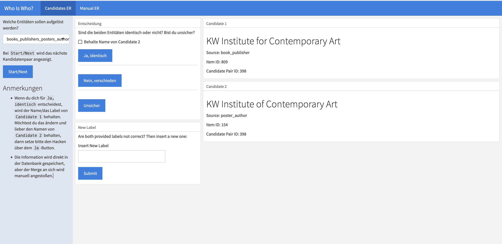

# Data Gathering

The first step is to merge different data sources. 
The scripts for this can be found in the repo under `data-gathering`.


## Infrastructure

### MariaDB

Initial converted data from Citavi and other sources are stored in a MariaDB.
Install and setup on [Mac with `homebrew`](https://mariadb.com/kb/en/installing-mariadb-on-macos-using-homebrew/).

```sql
CREATE DATABASE lgbtiq_kg 
  CHARACTER SET = 'utf8'
  COLLATE = 'utf8_german2_ci';
  
FLUSH PRIVILEGES;
ALTER USER 'root'@'localhost' IDENTIFIED BY 'NEW_PASSWORD';
```

## Citavi data dumps

Scripts: `data-gathering/from-citavi/`

There are three exports from Citavi data dumps that are normalized: `poster`, `books`, `digital`. 
All three are stored in a MariaDB.

Naming convention: 

* plurale: data -> `books_years`
* singular: relations -> `book_years`: relationship between `book_id` and `year_id`

### Books data model


#### Poster data model


### Views

#### Books

A wide view on all books

```sql
CREATE VIEW books_wide AS
SELECT 
books.book_id, 
books_authors.author_id,
books_editors.editor_id,
books_locations.location_id,
books_publishers.publisher_id,
books_series.series_id,
books_years.year_id,
books.name, 
books_authors.author,
books.isbn,
books.subtitle, 
books.title_supplement,
books_editors.editor,
books_locations.location,
books_publishers.publisher,
books_series.series,
books_years.year
FROM books
-- add authors
LEFT JOIN book_author ON books.book_id = book_author.book_id
LEFT JOIN books_authors ON book_author.author_id = books_authors.author_id
-- add editors
LEFT JOIN book_editor ON books.book_id= book_editor.book_id
LEFT JOIN books_editors ON book_editor.editor_id = books_editors.editor_id
-- add locatiONs
LEFT JOIN book_locatiON ON books.book_id= book_locatiON.book_id
LEFT JOIN books_locatiONs ON book_locatiON.locatiON_id = books_locatiONs.locatiON_id
-- add publishers
LEFT JOIN book_publisher ON books.book_id= book_publisher.book_id
LEFT JOIN books_publishers ON book_publisher.publisher_id = books_publishers.publisher_id
-- add series
LEFT JOIN book_series ON books.book_id= book_series.book_id
LEFT JOIN books_series ON book_series.series_id = books_series.series_id
-- add years
LEFT JOIN book_year ON books.book_id= book_year.book_id
LEFT JOIN books_years ON book_year.year_id = books_years.year_id;
```
#### Posters

Wide View on posters data.

```sql
CREATE VIEW posters_wide AS
SELECT 
posters.poster_id,
posters_authors.author_id,
posters_years.year_id,
posters_keywords.keyword_id,
posters.title,
posters.size,
posters_authors.author,
posters_years.year,
posters_keywords.keyword

FROM posters
-- add authors
LEFT JOIN poster_author ON posters.poster_id = poster_author.poster_id
LEFT JOIN posters_authors ON posters_authors.author_id = poster_author.author_id
-- add years
LEFT JOIN poster_year ON posters.poster_id = poster_year.poster_id
LEFT JOIN posters_years ON posters_years.year_id = poster_year.year_id
-- add keywords
LEFT JOIN poster_keyword ON posters.poster_id = poster_keyword.poster_id
LEFT JOIN posters_keywords ON posters_keywords.keyword_id = poster_keyword.keyword_id
;
```

## Entity Resolution

Deduplication, entitiy resolultion, entity linking etc. is a main and re-accuring task in this project. 

A first setup to tackle the task is two-fold: 

1. Calculate text similarities between entitity stings based on cosine similarity
2. Human decision making

### Calculate text similarities between entitity stings based on cosine similarity

* based on `quanteda`
* scripts under `data-gathering/entity-resolution`
* cosine minimum similiarty is set to 0.75 (for authors and publishers from posters and books)

### Human decision making

* Shiny app called "Who is Who?" to show possible matching candidates
* decision by button clicking
* code in `apps/entity-resolver`
* results saved in `er_candidates`




### Adding new candidates

To update the Shiny app in order to resolve new candidates these two steps are needed: 

* get new additional_infos in get-additional-infos.R
* add new source to get_candidates_names()

## New database with cleaned entries

In `lgbtiq_kg_clean` live all deduplicated entities.
So to say the end result of all scripts in `data-gathering/entitiy-resolution`

View `books_wide`: 

```sql

CREATE VIEW books_wide AS
SELECT 
entities.id, 
books_authors.book_id, 
entities.name, 
books.name AS title,
books.subtitle,
books.isbn
FROM entities
INNER JOIN books_authors ON entities.id = books_authors.id
LEFT JOIN books ON books.book_id = books_authors.book_id;
```

View `psoters_wide`: 
```sql
CREATE VIEW posters_wide AS
SELECT DISTINCT
entities.id, 
posters_authors.poster_id, 
entities.name,
posters.title,
posters.short_title,
posters.filename,
posters.size,
posters_years.year
FROM entities
INNER JOIN posters_authors ON entities.id = posters_authors.id
LEFT JOIN posters ON posters.poster_id = posters_authors.poster_id
LEFT JOIN posters_years ON posters.poster_id = posters_years.year_id;;

```


View `entities_per_type`: Which entity appears where?

```sql
CREATE VIEW entities_per_type AS
SELECT 
entities.id, 
entities.name,
books_authors.book_id,
posters_authors.poster_id 
FROM entities
LEFT JOIN books_authors ON entities.id = books_authors.id
LEFT JOIN posters_authors ON entities.id = posters_authors.id;
```

## Named Entity Extraction

One of the more challenging parts of the project is NER (Named Entity Extraction) based on NLP.

### Source data

My text data that I label comes from the Munich LGBTIQ* Chronicle: 233 entries of very dense infomation about the chronological order of events. [See it yourself on forummuenchen.org](https://forummuenchen.org/lgbtiq-chronik/).

### Of-the-self NER models

The first step was to use different off-the-shelf models and inspect the results in a [rubrix webapp](https://rubrix.readthedocs.io/).

* [Spacy](https://github.com/cutterkom/remove-na-lgbtiq-queer-knowledge-graph/blob/main/data-gathering/named-entity-recognition/spacy_ner.py)
* [Flair](https://github.com/cutterkom/remove-na-lgbtiq-queer-knowledge-graph/blob/main/data-gathering/named-entity-recognition/flair_ner.py)
* [Bert-based model using huggingface transformers](https://github.com/cutterkom/remove-na-lgbtiq-queer-knowledge-graph/blob/main/data-gathering/named-entity-recognition/huggingface_ner.py)

All three performed medicore, in three different ways. 

I decided to continue with spacy, because it has such an extensive documentation of training a NER model as well as using [rule-based patterns](https://spacy.io/usage/rule-based-matching).


### Rule-based entity extraction

Beside a model-based approach, I also use patterns to extract entities.
In contrast to the former, this works quite well for date expressions and addresses. 

[Script](https://github.com/cutterkom/remove-na-lgbtiq-queer-knowledge-graph/blob/main/data-gathering/named-entity-recognition/spacy_ner.py)

#### Rules for extracting addresses

<script src="https://gist.github.com/cutterkom/9806eabf6c66e07997c0ac096bf82799.js"></script>

#### Rules for extracting date related infos

<script src="https://gist.github.com/cutterkom/dee09712bdda23c91cf28e4e536d166e.js"></script>


#### Extract entities from lists

Also, I look up entities, I have in the database already.
This seems not to work off-the-self very well. For example, when `Landeshauptstadt München` is registered as a publisher or author, it overwrites the `location` entity for "München". Really not what I want.  


### Model-based approach: Labeling and training

[Code in Notebook](https://github.com/cutterkom/remove-na-lgbtiq-queer-knowledge-graph/blob/main/data-gathering/named-entity-recognition/train_spacy.ipynb)

I labeled the data using rubrix and used quite a lot of labels: 15. 

There is a conflict of goals: for the structured, linked data, I want the annotations to be as detailed as possible. However, for training a NER model I need larger amounts of data and it is smarter to use labels that unify several domains under themselves. For example: Clubs and organisations both run under `ORG`.

The distribution is quite skewed. There are labels like `AWARD` or `Slogan` that are definitly to specific to use in a training. 


Therefore, also the trained model does not perform very well, diplomatically speaking. See: 


That's why I decided to combine labels, e.g. all `CLUB`s will be a `ORG` and use only a subpart of labels: 

```python
keep_label = ["PER", "LOC", "EVENT", "LAW", "ORG", "CLUB", "CITY", "COUNTRY", "MOVEMENT", "PARTY", "AWARD"]

label_dict = {"CLUB":"ORG", "PARTY":"EVENT", "MOVEMENT":"EVENT", "AWARD": "EVENT"}
```

This improved the best models metrics a bit, but still too bad for usage: 

```json
"performance":{
  "ents_f":0.5130111524,
  "ents_p":0.6699029126,
  "ents_r":0.4156626506,
  "ents_per_type":{
    "LAW":{
      "p":0.7,
      "r":0.7,
      "f":0.7
    },
    "ORG":{
      "p":0.5714285714,
      "r":0.4666666667,
      "f":0.5137614679
    },
    "PER":{
      "p":0.9,
      "r":0.5142857143,
      "f":0.6545454545
    },
    "EVENT":{
      "p":0.5,
      "r":0.2222222222,
      "f":0.3076923077
    },
    "LOC":{
      "p":0.7272727273,
      "r":0.2424242424,
      "f":0.3636363636
    },
    "CITY":{
      "p":0.75,
      "r":0.4285714286,
      "f":0.5454545455
    },
    "COUNTRY":{
      "p":1.0,
      "r":0.3333333333,
      "f":0.5
    }
  }
```
